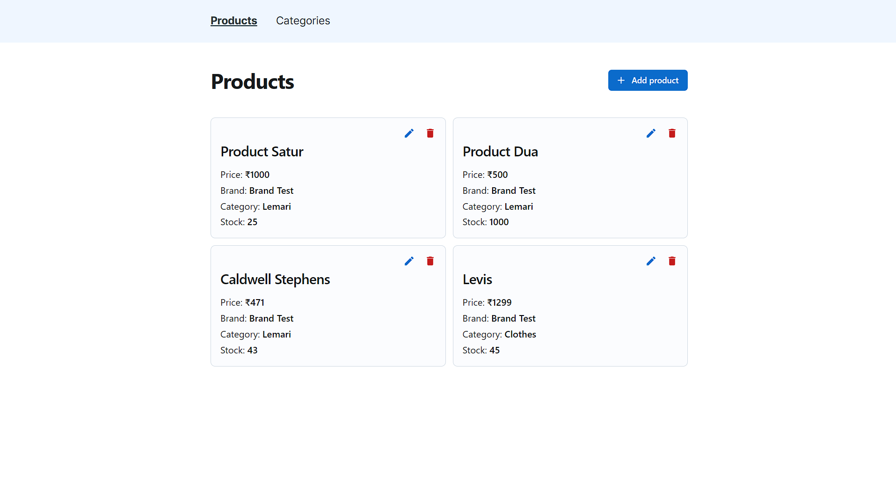

# Product inventory

<!-- ### For live demo [click here](https://freeweather.vercel.app) -->

## Description

A product inventory app to manage products along with categories with all CRUD oprations.

## Installation

1. Clone the repository: `git clone https://github.com/itsajaygaur/inventory.git`
2. Navigate to the project directory: `cd your-repo`
3. Install dependencies: `npm install`
4. Configure environment variables:
   - Create a `.env.local` file in the root directory based on `.env.example`
   - Set up API_URL and login TOKEN
5. Start the development server: `npm run dev`

## Usage

1. Start the development server using the instructions above.
2. Open your browser and navigate to `http://localhost:3000` (or the specified port).
3. Add, update or delete the products and category.
